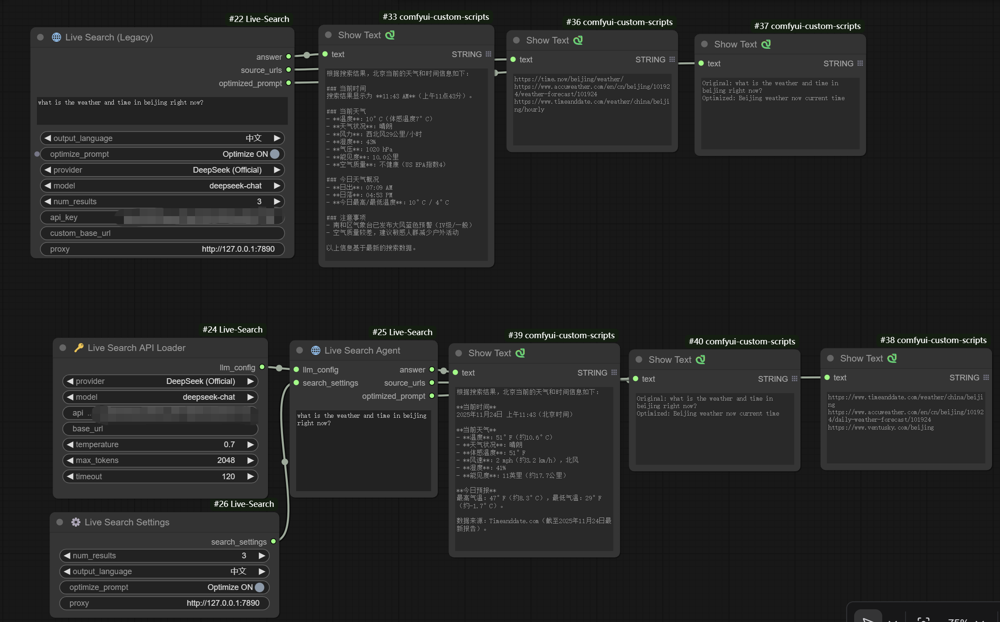

<div align="center">

# 🌐 ComfyUI Live Search Agent

**ComfyUI 的实时联网搜索与 AI 总结节点**

[](LICENSE)
[](https://www.python.org/)
[](https://www.deepseek.com/)

[中文文档](README_CN.md) | [English](README.md)

</div>

---

## 📖 项目简介

**ComfyUI Live Search Agent** 是一个强大的自定义节点，旨在打通 ComfyUI 与实时互联网之间的壁垒。

它结合了 **DuckDuckGo 搜索** 的广度与 **DeepSeek/OpenAI 等大模型** 的深度，能够自动抓取网页、阅读内容并提取你所需要的信息。无论你是需要获取当下的天气数据、新闻摘要，还是为图像生成寻找精确的事实依据，这个节点都能轻松搞定。

## 🏗️ 新版架构设计

**参考 [comfyui_LLM_party](https://github.com/heshengtao/comfyui_LLM_party) 的优秀设计**，我们采用了**模块化分层架构**：

### 📊 节点组合

```
🔑 API Loader → ⚙️ Settings → 🌐 Search Agent → 输出结果
```

| 节点 | 功能 | 输出 |
|------|------|------|
| **🔑 Live Search API Loader** | API 配置和模型选择 | LLM_CONFIG |
| **⚙️ Live Search Settings** | 搜索参数配置 | SEARCH_SETTINGS |
| **🌐 Live Search Agent** | 主搜索逻辑 | answer, source_urls, optimized_prompt |

### ✅ 新架构优势

- **模块化设计**：配置与逻辑分离，更易维护
- **可复用性**：一个 API Loader 可连接多个 Agent
- **灵活性**：不同场景使用不同的 Settings 组合
- **专业性**：符合大型项目的最佳实践

### 🔄 向后兼容

- 旧版单节点 `🌐 Live Search (Legacy)` 仍然可用
- 建议新用户使用新的三节点组合

---

## ✨ 核心特性

- **🔍 双搜索引擎支持**：
  - **DuckDuckGo**：（默认推荐）保护隐私，无需 API Key，对云端服务器友好，无广告干扰。
  - **Google**：经典的搜索选择，适合特定需求。
  
- **🧠 DeepSeek 原生支持**：
  - 完美支持 **DeepSeek-V3** 和 **DeepSeek-R1**。
  - 内置 **官方 API**、**阿里云 (百炼)** 和 **火山引擎 (方舟)** 的接口支持。
  - 智能映射：使用阿里云时，自动将 `deepseek-chat` 映射为 `deepseek-v3`。

- **🌤️ 智能模式**：
  - **天气/时间模式**：只需输入经纬度（如 `30.6, 104.0`），节点自动搜索并总结当地的实时时间与天气。
  - **智能搜索 (Smart Search)**：使用 LLM 先优化你的模糊提问，再进行精准搜索。

- **☁️ 云端与隐私安全**：
  - **API Key 安全**：在节点界面输入的 Key **绝不** 保存到本地硬盘（完美适配 AutoDL、RunningHub 等共享云环境）。
  - **本地配置**：同时也支持 `api_config.json`，方便本地部署用户持久化配置。

## 🚀 安装说明

### 方法一：通过 ComfyUI Manager 安装（推荐）

1. 在 ComfyUI 中打开 **Manager** 面板
2. 点击 **Install Custom Nodes**
3. 搜索 `Live Search`
4. 点击 **Install** 并重启 ComfyUI

### 方法二：Git 克隆

进入你的 ComfyUI `custom_nodes` 目录并运行：

```bash
git clone https://github.com/Zone-Roam/ComfyUI-Live-Search.git
cd ComfyUI-Live-Search

# 如果使用 Portable 版本的 ComfyUI（推荐）
..\..\..\python_embeded\python.exe -m pip install -r requirements.txt

# 如果使用系统 Python 或虚拟环境
pip install -r requirements.txt
```

然后重启 ComfyUI。

### 方法三：手动安装

1. 下载本项目的 ZIP 压缩包
2. 解压到 `ComfyUI/custom_nodes/ComfyUI-Live-Search`
3. 参考方法二安装依赖
4. 重启 ComfyUI

## 🛠️ 使用指南

### 📸 工作流示例

下图展示了两种使用方式：
- **左侧**: Legacy单节点模式 - 简单快速,所有配置集中在一个节点
- **右下方**: 新版模块化架构 - API Loader + Settings + Agent,更灵活可复用



---

### 方式一：新版模块化架构（推荐）⭐

#### 1. **🔑 Live Search API Loader**

配置 LLM API 和模型参数。

| 参数 | 说明 |
|------|------|
| **provider** | 选择提供商：OpenAI, DeepSeek, Gemini, Anthropic, Grok, Doubao, Qwen, Ollama 等 |
| **model** | 从下拉列表选择模型 |
| **api_key** | API密钥（可选，支持 .env） |
| **base_url** | API地址（可选，默认使用标准地址） |
| **temperature** | 温度参数 (0.0-2.0) |
| **max_tokens** | 最大输出长度 |
| **timeout** | 请求超时时间 |

#### 2. **⚙️ Live Search Settings**

配置搜索行为。

| 参数 | 说明 |
|------|------|
| **num_results** | 搜索结果数量 (1-10) |
| **output_language** | 输出语言：Auto / 中文 / English |
| **optimize_prompt** | 是否优化搜索词 |
| **proxy** | 代理地址（可选） |

#### 3. **🌐 Live Search Agent**

主搜索节点，连接上述两个节点。

| 输入 | 类型 | 说明 |
|------|------|------|
| **prompt** | STRING | 你的问题 |
| **llm_config** | LLM_CONFIG | 来自 API Loader |
| **search_settings** | SEARCH_SETTINGS | 来自 Settings |

| 输出 | 说明 |
|------|------|
| **answer** | AI 生成的答案 |
| **source_urls** | 引用来源链接 |
| **optimized_prompt** | 优化后的搜索词 |

---

### 方式二：Legacy 单节点模式

#### 节点：**🌐 Live Search (Legacy)**

#### 参数说明

| 参数名 | 说明 |
| :--- | :--- |
| **prompt** | 你的问题。支持中英文。例如 *"北京现在的天气"* 或 *"Who won the Super Bowl?"* |
| **output_language** | 🌐 输出语言<br>• **Auto (跟随输入)**（默认）：根据问题语言自动判断<br>• **中文**：强制使用中文回答<br>• **English**：强制使用英文回答 |
| **optimize_prompt** | 🔄 提示词优化开关（推荐开启）<br>• **关闭**（默认）：直接使用原始输入搜索<br>• **开启**：LLM 将问题优化为更精准的搜索关键词<br>  - 保持原语言（中文→中文，英文→英文）<br>  - 去除冗余词汇，保留核心信息<br>  - 输出优化前后对比 |
| **search_engine** | 🔍 **DuckDuckGo**（唯一选项）<br>• 稳定可靠，对自动化访问友好<br>• 无需额外配置即可工作<br>• 搜索质量完全满足需求 |
| **provider** | 选择 LLM 提供商：支持 `OpenAI`, `DeepSeek (官方/阿里云/火山)`, `Gemini` 等。 |
| **model** | 🎯 模型选择（下拉列表）<br>• **OpenAI**: gpt-4o, gpt-4o-mini, gpt-4-turbo, o1-preview 等<br>• **DeepSeek**: deepseek-chat, deepseek-reasoner<br>• **Gemini**: gemini-2.0-flash-exp, gemini-1.5-pro 等<br>• 支持搜索过滤，快速找到所需模型 |
| **api_key** | （可选）你的 API Key。留空则尝试读取配置文件。 |
| **proxy** | （可选）代理地址，如 `http://127.0.0.1:7890`。留空则直连。 |

#### 输出说明

| 输出名 | 说明 |
| :--- | :--- |
| **answer** | AI 根据搜索结果生成的答案 |
| **source_urls** | 引用的网页链接列表 |
| **optimized_prompt** | 显示提示词优化情况（是否优化、优化前后对比） |

#### 典型工作流示例

**1. 实时天气生图**
- **输入**: `"北京现在的天气"`
- **优化开关**: `开启` ✅
- **优化结果**: `"北京 实时天气 当前时间"`
- **输出**: "北京当前时间下午 3 点，晴天，气温 10°C。" 
- → [连接到提示词节点] → 生成北京晴天街景图

**2. 事实查询**
- **输入**: `"最新的奥斯卡最佳影片"`
- **优化开关**: `开启` ✅
- **输出**: 基于实时搜索结果的准确回答

**3. 跨语言查询**
- **输入**: `"What's the weather in Beijing?"` (英文问题)
- **输出语言**: `中文` 🇨🇳
- **优化开关**: `开启` ✅
- **输出**: 北京实时天气信息（**用中文回答**）

**4. 国际协作场景**
- **输入**: `"北京现在的天气"` (中文问题)
- **输出语言**: `English` 🇺🇸
- **输出**: Beijing weather info (**answered in English**)

## 🔍 为什么只支持 DuckDuckGo？

本节点使用**真实的网页爬虫**进行搜索，而非 API 调用。在实际测试中：

**✅ DuckDuckGo 的优势**：
- 对自动化访问友好，反爬虫机制相对宽松
- 即使配置代理也能稳定工作
- 搜索质量完全满足实时信息检索需求
- 开源友好，社区支持良好

**❌ Google 的问题**：
- 极其严格的反爬虫机制（验证码、IP 封锁、User-Agent 检测）
- 即使挂代理也经常返回空结果或验证码页面
- `googlesearch-python` 库在生产环境中不稳定
- 频繁访问会导致 IP 被暂时封禁

**💡 如果需要 Google 搜索质量**：
- 可以考虑使用官方的 **Google Custom Search API**（需付费）
- 或者使用 **SerpAPI** 等第三方服务（需付费）

我们选择 DuckDuckGo 是为了确保节点在各种环境下都能**稳定可靠**地工作。

---

## ⚙️ 高级配置（可选）

如果你是在本地电脑使用，不想每次都复制粘贴 API Key，有两种配置方式：

### 方式一：使用 .env 文件（推荐）⭐

1. 将 `.env.example` 复制为 `.env`
2. 编辑 `.env` 文件并填入你的 API keys：

```bash
OPENAI_API_KEY=sk-your-openai-key-here
DEEPSEEK_OFFICIAL_API_KEY=sk-your-deepseek-key-here
```

**优势**：
- ✅ 符合业界标准实践
- ✅ 自动被 `.gitignore` 排除，不会意外提交到 Git
- ✅ 更安全，更专业

### 方式二：使用 api_config.json

1. 将 `api_config_example.json` 重命名为 `api_config.json`
2. 编辑并填入你的 API keys：

```json
{
    "openai_api_key": "sk-...",
    "deepseek (official)_api_key": "sk-..."
}
```

### API Key 优先级

```
节点输入框 (最高) > .env 文件 > api_config.json (最低)
```

> **注意**：在云端平台使用时，请务必直接在节点输入框填写 Key，以保证安全。

## 📄 许可证

Apache 2.0 License

